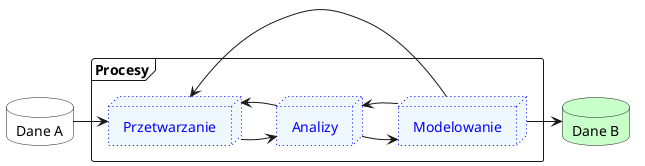

# Czym jest danetyka?
_25.03.2023 | danetyk.pl_
### Na początek odrobina historii
Jeżeli choć odrobinę interesujecie się programowaniem i tematami pokrewnymi, a ostatnich 10 lat nie spędziliście
na Erasmusie wśród Amiszów, to nie ma opcji, abyście nie spotkali się do tej pory z terminem _Data Science_.
Jeżeli jednak jakimś cudem ominęły Was ostatnie lata życia w cywilizacji, to pozwólcie, że opowiem Wam krótką
bajeczkę.

Wcale nie tak dawno, bo w 1962 roku, i wcale nie tak daleko, bo na kampusie Uniwersytetu w Princeton,
pomieszkiwał sobie za kasę amerykańskich podatników pewien jegomość, 
[John Tukey](https://en.wikipedia.org/wiki/John_Tukey). Był to osobnik o szczególnej aparycji i równie
wyróżniających się umiejętnościach we władaniu matematyką i statystyką, przez co żyło mu się nad wyraz łatwo
i przyjemnie w porównaniu do reszty ówczesnego społeczeństwa. Osobnik wyróżniał się jak na swoje czasy
nie tylko umiejętnościami ścisłymi, ale również humanistycznymi, bo parał się, dość biegle zresztą,
jasnowidztwem. Przewidział mianowicie, że w bliskiej przyszłości komputery znajdą swoje zastosowanie
w rozwiązywaniu problemów statystycznych tak, jak do tej pory służyły w rozwiązywaniu problemów matematycznych.
Ostatecznie, wieszczył, nastąpi połączenie metod matematycznych, metod statystycznych oraz metod komputerowych
do nowej, zunifikowanej, interdyscyplinarnej dziedziny skupiającej się na analizie danych. 

> Co ciekawe, to najprawdopodobniej Tukey w swoim artykule z 1962 roku [[1]](#bibliografia) jako pierwszy zaproponował 
> i wykuł termin _Data Analysis_, czyli analiza danych.

Latka sobie mijały, aż w 1974 roku Peter Naur opublikował książkę zatytułowaną _Consice Survey of Computer Methods_,
w której przedstawił definicję przetwarzania i analizy danych pozostającą aktualną do dnia dzisiejszego. Definicję tę
można sprowadzić do następującej formy:

> Przetwarzanie i analiza danych, to zbiór procesów które na podstawie zbioru danych A tworzą zbiór danych B 
> zapewniający przy pomyślnych wiatrach nowe informacje względem zbioru A. Nowy zbiór danych B powinien pozwalać 
> na realizację bardziej efektywnych działań, niż zbiór A.

Dziś należy dodać jeszcze do przetwarzania i analizy danych modelowanie danych. Co ważne na każdym z wymienionych
etapów może być konieczne cofnięcie się do etapu poprzedniego, tj. po przetworzeniu danych i rozpoczęciu pierwszej
tury analiz możemy dojść do wniosku, że powinniśmy przetworzyć dane raz jeszcze, tym razem inaczej, po czym powtórzyć
analizy itd. Niemniej, procesy przetwarzania, analizy i modelowania danych trwają do momentu, aż uzyskamy wnioski 
rozwiązujące nasz problem.

Wszystko można przedstawić wizualnie w sposób następujący:

No dobrze, a jaką rolę odgrywa każdy z trzech wymienionych procesów? Najlepiej będzie jeżeli przyjrzymy się w sposób
bardziej drobiazgowy każdemu z nich na prostych przykładach. Jednak zanim to zrobimy, to szybka odpowiedź na pytanie
o to, po co w ogóle to robimy. Czyli po co w ogóle "danetykujemy"?

### Dane a informacje

Zacznijmy od szybkiego wytłumaczenia czym są dane oraz czym są informacje. Dane, to suche fakty, których odpowiednie
przetworzenie i analiza mogą zapewnić informacje, czyli użyteczne wnioski z punktu widzenia interesariusza
(ang. *stakeholder*), czyli osoby, która dzięki tym wnioskom będzie mogła usprawnić wybrany aspekt działania
np. swojej firmy. Dla przykładu, danymi mogą być wiek, wykształcenie oraz dochód klientów banku, natomiast
informacją jest ewentualna zależność między wiekiem i wykształceniem a dochodem klientów.

> W skrócie, dane, to suche fakty, natomiast informacje, to użyteczne wnioski.

Oczywiście, nic nie stoi jednak na przeszkodzie, aby informacje stały się danymi, na podstawie których zostaną
wyciągnięte natomiast kolejne wnioski, czyli powstanie kolejny poziom informacji itd.

### A dlaczego? A komu to potrzebne?

No dobrze, danetykujemy, żeby dane przekuwać w informacje. Ale tak po ludzki: Jakie to ma zastosowanie 
w życiu codziennym z punktu widzenia danetyka i danetyczki? Po prawdzie ciężko jest tutaj podać skończoną listę
obszarów, w których danetyka może lub jest wykorzystywana, ale do niektórych można zaliczyć:

* Energetyka (np. analiza przepustowości sieci przesyłowych dla wielu źródeł energii różnego typu dla różnych lokalizacji i różnych pór dnia i roku)
* Transport (np. analiza zagęszczenia ruchu drogowego na wybranych odcinkach w zależności od pory dnia oraz pracy sygnalizacji świetlnej)
* Logistyka (np. analiza wolumenu transportowego, jego szybkości i kosztów w zależności od rodzaju transportu)
* Medycyna (np. analiza danych pacjentów pod kątem optymalizacji zespołu wybranego szpitala pod kątem dobrania odpowiedniej liczby lekarzy danych specjalności)
* Badania kliniczne (np. analiza skuteczności nowych leków w zależności od charakterystyki pacjentów)
* Diagnostyka (np. opracowywanie zautomatyzowanych rozwiązań i metod diagnostycznych)
* Farmacja (np. przyspieszenie procesu wynajdywania nowych związków o potencjale leczniczym)
* Produkcja (np. usprawnianie i optymalizacja procesów i linii produkcyjnych)
* Motoryzacja (np. rozwój rozwiązań autonomicznych zwiększających bezpieczeństwo na drodze)
* E-Commerce (np. analiza danych klientów pod kątem usprawnienia personalizacji reklam, ofert i rekomendacji produktów)
* Cyberbezpieczeńśtwo (np. usprawnienie procesów wykrywania oszustw i exploitów)
* Finanse (np. analiza rynków, szacowanie ryzyka inwestycji, czy też choćby personalizacja ofert produktów finansowych dla klientów banków w zależności od ich profilu)
* I wiele innych... Gdzie dla przykładu możemy napomknąć o "sztucznych inteligencjach" wykorzystywanych obecnie niemal do wszystkiego, przez wszystkich i wszędzie (polecam przy okazji film "Wszystko wszędzie naraz" - perełka)

Jak więc widzimy danetykować możemy praktycznie w dowolnej branży, gdzie przetwarza się dane na informacje.
A z uwagi na fakt, że w dzisiejszych czasach robi się to niemal wszędzie, to i niemal wszędzie każdy znajdzie
coś dla siebie.

> Ilość przetwarzanych danych na całym świecie w roku 2010 wynosiła 2 zetabajty. W roku 2022 było to już 97 zetabajtów. 
> Natomiast przewiduje się liberalnie, że w roku 2025 będzie to już 181 zetabajtów. Zwracam tutaj uwagę na to, 
> że jeden zetabajt, to jeden bilion, czyli tysiąc miliardów gigabajtów. Także ten... Sporo, no.

### Na czym polega przetwarzanie, analizowanie i modelowanie danych?

Powiedzmy, że dostaliśmy już swoją pierwszą pracę w danetyce, siedzimy przed komputerem po pierwszym spotkaniu naszego
nowego zespołu i wiemy, że "musimy wziąć te dane, zrobić te nasze czary mary i jak już skończymy to dać znać co nam 
tam wyszło". Oczywiście tutaj sarkastycznie i straszliwie wręcz dewaluuję często bardzo ciekawe spotkania i dyskusje
poprzedzające jakiekolwiek analizy. Najpierw bowiem najczęściej ustalane są bieżące potrzeby interesariuszy, po czym 
w zależności od tego, czy pracujemy sami, czy w zespole, ustalany jest plan działania; to znaczy formułujemy pytania,
na które chcemy odpowiedzieć, a także problemy, które chcemy rozwiązać za pośrednictwem przyszłego przetwarzania,
analizowania i modelowania danych.

Następnie dane pozyskujemy, co może przyjąć różnoraką formę, w zależności od firmy, naszych celów, i jeszcze wielu
innych czynników. Jednak ostatecznie, dane, na których będziemy pracować, najczęściech pochodzą z _web scrappingu_,
baz danych SQL i noSQL, jak również z wszelkiej maści plików (CSV, JSON, XLSX, TXT i wiele innych). W zależności od tego
w jakiej formie dane są przechowywane, to inaczej będzie oczywiście wyglądał proces ich pozyskania i wstępnego przejrzenia.
Tym jednka nie będę zajmował się w tym artykule, więc załóżmy, że dane już pozyskaliśmy. Co dalej?

Teraz musimy dane przejrzeć w celu wstępnej oceny ich jakości oraz potencjalnej przydatności w odpowiadaniu na postawione
na początku danetycznego procesu pytania. Dane najczęściej przeglądamy w celu zapoznania się z występującymi w nich
zmiennymi, jak również w celu oszacowania występowania braków oraz błędów w danych. Jeżeli uważamy, że z pozyskanymi
danymi jesteśmy w stanie zrobić coś użytecznego, to przechodzimy do ich przetwarzania.

Tak, jak nie ma dwóch takich samych zestawów danych, tak również nie ma jednego, stałego zestawu kroków, które
zawsze wykonujemy podczas ich przetwarzania. Najczęściej jednak sprowadza się to do tego, że dane czyścimy, 
transformujemy, redukujemy, dyskretyzujemy, a także normalizujemy. Pozwólcie, że omówię pokrótce każdy z tych kroków.

Czyszczenie danych

Podczas czyszczenia danych staramy się w głównej mierze zidentyfikować braki oraz błędy w danych,
po czym w odpowiedni sposób im zaradzić.

Tutaj zachęcam do odwiedzania [profilu danetyk.pl na portalu Kaggle](https://www.kaggle.com/danetykpl),
gdzie możecie i/lub będziecie mogli znaleźć [notebooki](https://www.kaggle.com/danetykpl/code) omawiające i implementujące każdy z wymienionych kroków
na różnych zestawach danych. Jeżeli macie jakieś pomysły, czy też preferencje dotyczące tego, jakie tematy
powinny być poruszane zarówno na Kaggle, jak i na GitHubie, to dawajcie znać [tutaj](https://github.com/danetykpl/danetykpl/issues).

> W telegraficznym skrócie głównym celem danetyki, niezależnie od sektora w którym jest wykorzystywana, jest rozwiązywanie
problemów interesariuszy (ang. *stakeholders*) za pośrednictwem przetwarzania, analizowania i modelowania danych. 

Ciężko jest tutaj podać skończoną listę zastosowań danetyki, ale do niektórych można zaliczyć:

1. wykrywanie oszustw i szacowanie ryzyka np. w sektorze finansowym,
2. personalizacja reklam, ofert i rekomendacji np. w sektorze e-commerce,
3. optymalizacja łańcuchów dostaw i szlaków komunikacyjnych np. w transporcie,
4. zaawansowane rozpoznawanie obrazów np. w medycynie,
5. weryfikacja skuteczności nowych leków w badaniach klinicznych,
6. modelowanie obciążeń sieci energetycznych w energetyce.

Oczywiście zastosowań danetyki jest o wiele więcej, gdzie tak naprawdę jedynym ograniczeniem są dane, które posiadamy
oraz nasza wyobraźnia. Jednak niemal za każdym razem, niezależnie od sektora, w którym pracujemy oraz rodzaju 
problemu, przed którym zostaliśmy postawieni, kroki, które musimy zrealizować celem jego rozwiązania są bardzo podobne.
Wszystko jednak zaczyna się od spotkania z interesantami i zwrócenia ich uwagi na problem, który mamy rozwiązać.
Zastanawiamy się następnie jakiego rodzaju dane mogą nam w tym pomóc, po czym uzyskujemy do nich dostęp i zaczynamy...

### Czym jest przetwarzanie danych?
Rzadko kiedy dane, do których uzyskaliśmy dostęp od razu nadają się do analiz, które przybliżą nas do rozwiązania
problemu. Często są to dane pochodzące z różnych źródeł, które najpierw należy w sensowny sposób zintegrować. Wyobraźmy
sobie prostą sytuację, w której podsumowujemy rok funkcjonowania sklepu internetowego, gdzie dane klientów mamy
w relacyjnej bazie danych, wyniki sprzedaży w arkuszach kalkulacyjnych, a dane dotyczące aktywności na stronie internetowej
w formie plików *.csv. Na podstawie takich danych możemy przygotować bardzo wartościowy raport podsumowujący
funkcjoniwanie sklepu w roku minionym z potencjalnymi predykcjami na rok następny. Zanim jednak to zrobimy, to musimy
się zastanowić na jakie właściwie pytania chcemy udzielić odpowiedzi. Dla przykładu:

1. Czy istnieje zależność między wybranymi zmiennymi definiującymi klienta (np. płeć, wiek, miejsce zamieszkania) 
a jego aktywnością na stronie (np. czas spędzony na przeglądaniu produktów), preferencjami zakupowymi oraz zyskiem 
sklepu ze sprzedaży?
2. W których miesiącach roku zanotowano najwyższą sprzedaż, jakie produkty cieszyły się wtedy największym zainteresowaniem,
a także jacy klienci byli wtedy najbardziej aktywni?
3. Czy istnieją w danych zależności i trendy na podstawie, których można dokonać decyzji w ramach polityki cenowej produktów
oraz marketingu, które pozwolą zwiększyć sprzedaż w najbliższym roku?

To oczywiście tylko przykład, ale już widzimy, że dla tak sformułowanych pytań, aż się prosi, aby ujednolicić sposób
reprezentowania danych na razie pochodzących z trzech różnych źródeł i z trzech różnych formatów plików. W zależności od tego
w jakich narzędziach się specjalizujemy, to droga do wspomnianego ujednolicenia będzie różna, ale dla przykładu możemy
wszystkie dane wrzucić do tabel w relacyjnej bazie danych i powiązać klientów z ich aktywnością na stronie oraz 
z ich zakupami. W każdym razie, gdy już udało nam się zebrać do kupy w sensownej formie nasze dane, to teraz czas
je porządnie przejrzeć i wykonać następujące kroki:

1. Sprawdzić/określić typy danych w poszczególnych kolumnach i zweryfikować zgodność wprowadzonych wartości z ich domniemanymi typami.
2. Poprawić błędy/literówki w wybranych wartościach, jeżeli takowe występują.
3. Poradzić sobie z brakującymi wartościami.
4. Poradzić sobie z duplikatami wartości.
5. Jeżeli zajdzie taka potrzeba, to przekonwertować wybrane typy danych na inne typy.
6. Przeprowadzić normalizację wybranych zmiennych, czyli sprowadzić je do wspólnej, porównywalnej skali.
7. Przeprowadzić kodowanie zmiennych kategorialnych, czyli np. dla zmiennej `płeć` zmienić wartości `kobieta` i `mężczyzna` na `0` i `1`.
8. Przefiltrować, przekształcić, zredukować dane do pożądanego zakresu.

### Czym jest analizowanie danych?

### Czym jest modelowanie danych?

### Danetyka kilka lat temu i dzisiaj

### No to czym jest ta danetyka?

### Bibliografia
1. Tukey JW (1962) The Future of Data Analysis. [Źródło](https://projecteuclid.org/journals/annals-of-mathematical-statistics/volume-33/issue-1/The-Future-of-Data-Analysis/10.1214/aoms/1177704711.full).
2. Naur P (1974) Consice Survey of Computer Methods.
3. Tukey JW (1977)